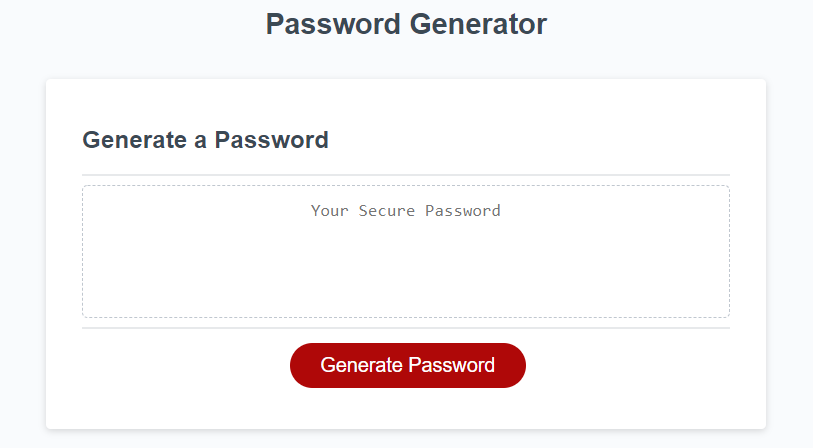
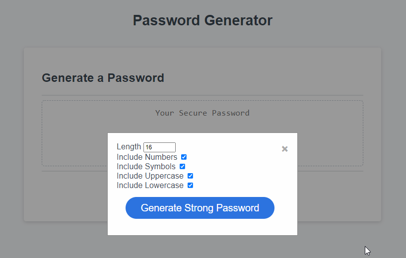
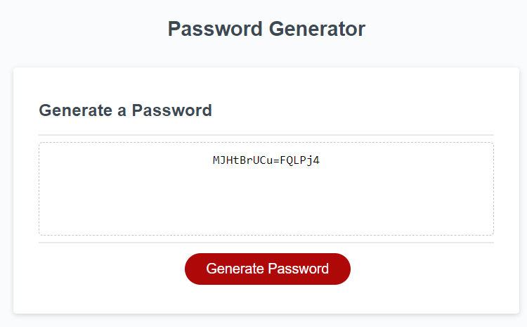

# passwordgenerator

The following project was conducted to create an application that enables employees to generate random passwords based on criteria that they’ve selected. The Password Generator allows the user to select the password lengnth as well as defining if numbers, symbols, uppercase letters, or lowercase letters, will be included.

<H2>Author</H2>
Nick Ross

<H2>Functionality</H2>

When clicking Generate Password, the user will have to ability to modify the password requirements. A minimum of 8 and maximum of 128 characters is required.

A strong, random password is then generated that meets those requirements.

